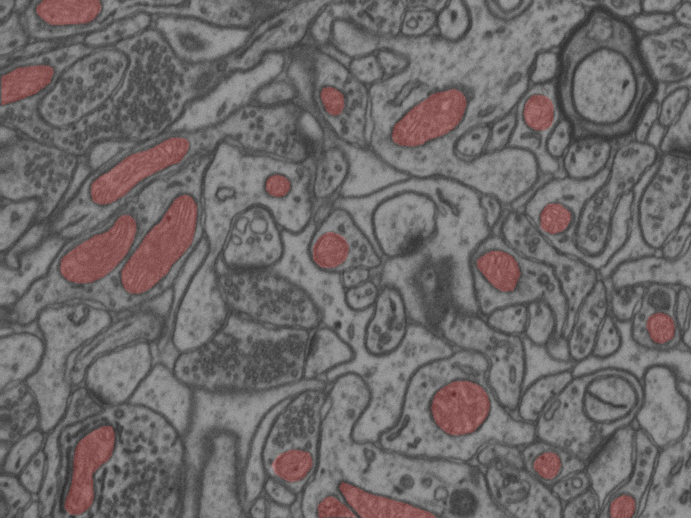
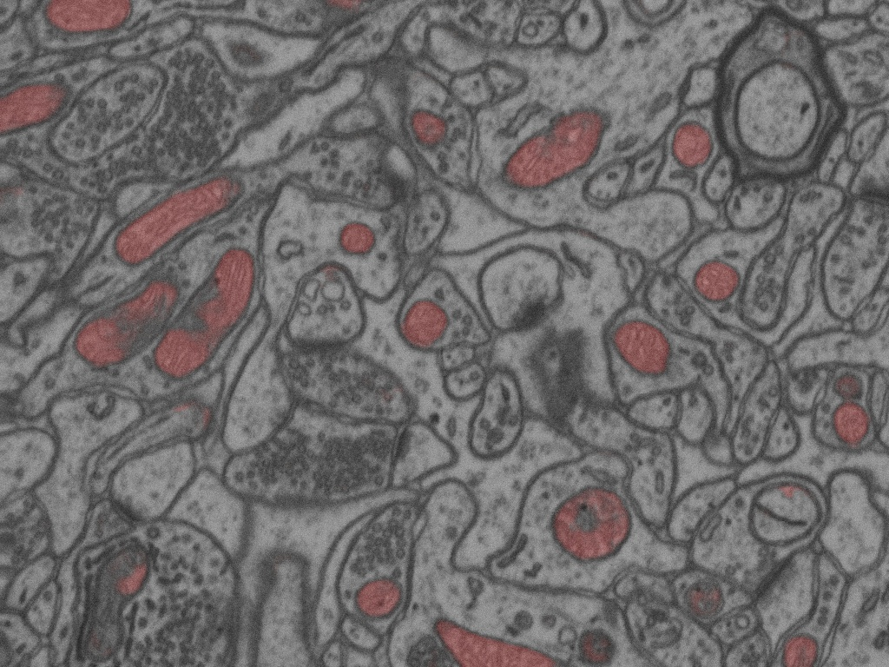

# EPFL-CVLab-Segmentation
 
Quick take on [EPFL CVLab dataset](https://www.kaggle.com/datasets/kmader/electron-microscopy-3d-segmentation), doing 2D segmentation using UNet network. Implemented with Python 3, Tensorflow 2.

Extract dataset file to a root data file
```
EPFL-CVLab-Segmentation
├── data
│   ├── testing_groundtruth.tif
│   ├── testing.tif
│   ├── training_groundtruth.tif
│   └── training_groundtruth.tif
├── ...
```

Visualize dataset with
```
$ python visualize_dataset.py
```
Train model with
```
$ python train.py
```
Visualize inference results on testin set with
```
$ python evaluate.py
```

File structure and model hyperparameters are configured in `config.py`.

## Example results
Results are achieved after 50 epochs of training without data augmentation.
True labels, segmented areas in red             |  Predicted segmentation map
:-------------------------:|:-------------------------:
  |  

